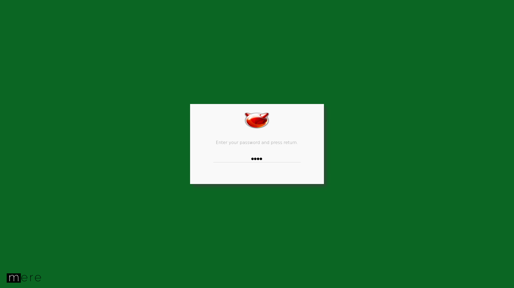

# mere-lock #
`mere-lock` is a utility program to lock screen ( and system wise locking is in
the plan). When the user invoked the program, it locks the screen and wais for 
user interaction - any key press or mouse activity. The program then prompts 
for the secret, usually the user's password, to unlock the screen. When the 
program is invoked without `--password` argument, it will match the password 
with the logged-in user password using the *pam* service. 

User may wish to NOT using the system's user password, instead using a
different one to unlock the screen - it can be done using `--password` argument.

The lock screen is quite configurable, such as
- change the background of the screen
  - color code
  - image path
- change or hide the logo used on the screen
  - image path
- change the background of the password prompt screen
  - color code or image path can
- change or hide the logo used in the password prompt screen
  - image path
- change the font color and size of the messages 

TODOs:
- Restrict on wrong attempts (but why and how?)
  - Record the person who made false attemps? maybe capturing the face using webcam? 
- VT locking
- System locking

### Screenshots
 

more screenshots are available [here](screenshots).

### Usage
Simply invoke the 'mere-lock' command. To get out of it, enter your password.

```shell
$ mere-lock --strict
```

If the user wishes to use a temporary password, then the invocation command 
would be:

```shell
$ mere-lock --strict --password secret
```

Tips: you can generate a password while invoking, and pass it using xargs!

### Dependencies
`mere-lock` requires following componnets
- C++11 
- QtCore
- X11
- [mere-utils](https://github.com/merelabs/mere-utils)
- [mere-auth](https://github.com/merelabs/mere-auth)
- [mere-config-lite](https://github.com/merelabs/mere-config-lite)
- [mere-widgets](https://github.com/merelabs/mere-widgets)
 
### Build
```shell
$ git clone https://github.com/merelabs/mere-lock.git
$ cd mere-lock
$ qmake
$ make release
```
*note:* check all the dependencies are installed before building `mere-lock`.

### Install

```shell
$ sudo make install
```

### Support
If you find a bug, or have a feature suggestion, please [log an issue](https://github.com/merelabs/mere-lock/issues). If you'd like to
contribute, please read [How to Contribute](CONTRIBUTING.md).

## License
All the code in this repository is licensed under a [BSD-2-Clause License](LICENSE).
